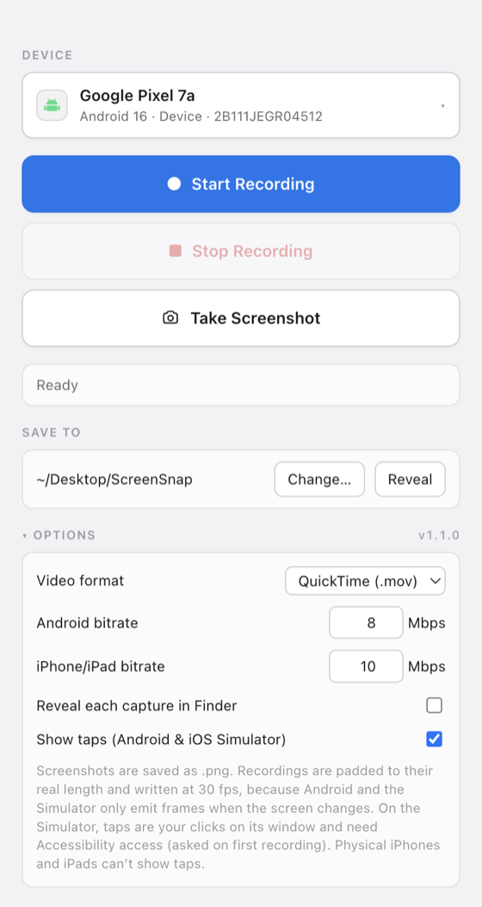

# ScreenSnap

A small macOS desktop app that records the screen of any connected Android or iOS
device — physical devices, Android emulators and iOS Simulators — and takes
screenshots, the way Android Studio's *Running Devices* pane does.

<p align="center">
  
</p>

## What it does

- Lists everything currently attached: Android devices and emulators, tethered
  iPhones and iPads, and booted iOS Simulators. The list refreshes every few
  seconds, so plugging a phone in is enough.
- **Start Recording** / **Stop Recording** — writes a `.mov` (or `.mp4`, see Options).
- **Take Screenshot** — writes a `.png`.
- **Show taps** (Options) — touches appear in the recording on Android devices,
  emulators and the iOS Simulator. Physical iPhones and iPads can't show taps.
- One save folder for everything, changeable from the main window and remembered
  between launches.

Files are named after the device and the moment of capture, for example
`Huawei_P20_lite_2026-09-04_14-31-07.mov`.

Android devices are listed by brand and the name people actually use for them,
not by the sales code `ro.product.model` reports: a P20 lite calls itself
`ANE-LX1` and an emulator `sdk_gphone64_arm64`, so the brand is taken from
`ro.product.manufacturer` (spelled the way the vendor spells it — `OnePlus`,
`OPPO`, `vivo`) and the name from whichever marketing-name property the vendor
filled in, or from the AVD name for an emulator.

### Why recordings are re-timed

Both `adb screenrecord` and `simctl recordVideo` only emit a frame when the
screen actually *changes*. Record a still screen and you get a file with a single
frame and no duration at all — QuickTime simply refuses to open it. Even a normal
take loses whatever happened after the last on-screen change, and some devices
(a Pixel 7a on Android 17, for one) report a track duration several times longer
than the take really ran.

So every recording is finished with an `ffmpeg` pass that pads the last frame out
to the time that actually elapsed, pins the length to that time, and writes
constant 30 fps. Real timing inside the clip is preserved — the recorders do
stamp their frames with true timestamps, so a four-second pause stays four
seconds long. Clips that already match their take are only remuxed, without
re-encoding.

## What it can and cannot access

- **Nothing is ever sent anywhere.** There is no HTTP, socket, DNS or websocket
  call anywhere in the source, no analytics, no crash reporting and no
  auto-updater. Checked at runtime with `lsof`: the running app opens zero
  network sockets across all of its processes.
- **No third-party runtime code.** The `dependencies` list is empty; the shipped
  `app.asar` contains only the six files in `electron/`, the built renderer, the
  icon and `package.json`. React and Vite are build-time only.
- **Only device screens are captured.** Android goes through `adb screenrecord` /
  `screencap` on the device itself. A tethered iPhone or iPad is read through the
  AVFoundation input macOS exposes for it — and only when `devicectl` or
  `xctrace` confirms an Apple device of that name is attached, so a webcam or
  capture card can never be offered as a device. The Mac's own screen and camera
  (`Capture screen 0`, `FaceTime HD Camera`) are excluded outright.
- **No audio, ever — recordings are silent by construction.** Nothing is ever
  recorded but the picture:
  - `adb screenrecord` and `simctl recordVideo` capture no audio at all.
  - `scrcpy` is launched with `--no-audio`, so it never opens the device's audio
    stream either.
  - A tethered iPhone is opened as `-i <video index>`; capturing sound would need
    a `video:audio` spec, which the app never builds, and `-an` is passed anyway.
  - Every ffmpeg output — re-encode, remux and segment join alike — is written
    with `-map 0:v:0 -an -dn -sn`, so only the video track survives even if a
    recorder ever produced an audio one. (Left to its defaults, ffmpeg would
    happily carry an audio stream through a `-c copy`.)
  - The app declares no microphone usage and never opens an audio device.
- **Writes stay in three places:** the capture folder you choose, a temporary
  working directory under `/tmp` that is deleted after each recording, and its
  own `settings.json`. The one thing ever written to a device is `scrcpy`'s own
  server jar in `/data/local/tmp`, and only for a device that needs it; `scrcpy`
  removes it again when it exits.
- **No shell is involved.** Every external tool is launched with `spawn()` and an
  argument array, so device names and serials can never be interpreted as shell
  syntax.

The renderer runs with `contextIsolation: true` and `nodeIntegration: false`,
loads no remote content, and can only reach the thirteen IPC calls listed in
`electron/preload.cjs`.

## Requirements

| Target | Needs | Notes |
| --- | --- | --- |
| Android device or emulator | `adb` | From Android platform-tools. USB debugging must be on and the device authorised. |
| Android devices with no `screenrecord` | `scrcpy` | `brew install scrcpy`. Only needed for ROMs that ship without the binary — Huawei's EMUI, notably. |
| iOS Simulator | Xcode (`xcrun simctl`) | The simulator must be booted. |
| Physical iPhone / iPad | Xcode + `ffmpeg` | `brew install ffmpeg`. Connect by USB, unlock the device and trust the Mac. |
| Android clips over 3 minutes | `ffmpeg` | Used to stitch the segments together. |

`adb` and `ffmpeg` are looked up in `/opt/homebrew/bin`, `/usr/local/bin` and
`~/Library/Android/sdk/platform-tools` as well as on `PATH`, so the packaged app
finds them even though Finder launches it with a bare environment.

## Running it

```bash
npm install
npm run dev     # Vite dev server + Electron with hot reload
npm start       # build once and run the app
npm run icon    # re-render the app icon from assets/icon.html
npm run pack    # build a distributable .dmg into release/
```

## How each platform is captured

- **Android** — `adb shell screenrecord` writes to `/data/local/tmp` on the
  device and the file is pulled when you stop. `screenrecord` on Android 10 and
  older hard-stops at 3 minutes, so recordings are chained as 180-second
  segments and concatenated with `ffmpeg` (stream copy, no re-encode). Android 11+
  records in one piece. Stopping sends `SIGINT` on the device, which is what makes
  `screenrecord` write a valid MP4 trailer — killing `adb` locally would leave a
  truncated file. Screenshots come from `adb exec-out screencap -p`.
- **Android without `screenrecord`** — the binary is stock AOSP but not
  guaranteed to be present: Huawei's EMUI images ship no
  `/system/bin/screenrecord` at all, and the device's shell answers
  `screenrecord: not found`. (Android Studio's screen recorder fails on those
  devices for the same reason.) Every Android device is therefore probed once
  with `screenrecord --help`, and one that lacks it is recorded with `scrcpy`
  instead, which pushes its own server to `/data/local/tmp` and drives
  `MediaCodec` and the display service from there — so it needs nothing from the
  system image but a hardware encoder. It runs with `--no-playback` (no
  mirroring window) and `--no-control` (no touch or key is ever injected into
  the device), and cleans its server up on exit. Such a device still takes
  screenshots normally; if `scrcpy` is not installed, the picker marks it
  *screenshots only* and Start Recording explains why rather than failing on
  click.
- **iOS Simulator** — `xcrun simctl io <udid> recordVideo` and
  `xcrun simctl io <udid> screenshot`.
- **Physical iPhone / iPad** — macOS exposes a tethered, trusted iOS device as an
  AVFoundation video input (the same feed QuickTime's *Movie Recording* uses).
  `ffmpeg` reads that input and encodes with VideoToolbox; a screenshot is a
  single frame grabbed from the same input. macOS will ask for camera permission
  the first time, and only one process at a time may hold the stream — so
  screenshots are disabled while that device is recording.

## Settings

Stored as JSON in `~/Library/Application Support/ScreenSnap/settings.json`.

| Key | Default | Meaning |
| --- | --- | --- |
| `outputDir` | `~/Desktop/ScreenSnap` | Where every capture is saved. |
| `videoFormat` | `mov` | Recording container: `mov` or `mp4`. |
| `androidBitrateMbps` | `8` | `screenrecord --bit-rate`. |
| `iosBitrateMbps` | `10` | Encoder bitrate for tethered iPhones/iPads. |
| `revealAfterCapture` | `false` | Reveal each finished file in Finder. |
| `showTouches` | `false` | Show taps while recording (Android and iOS Simulator). |
| `showOfflineDevices` | `false` | Include shut-down simulators in the picker. |

## Layout

```
electron/
  main.cjs       window, IPC handlers, quit handling
  preload.cjs    the only bridge the UI gets
  devices.cjs    discovery across adb / simctl / devicectl / AVFoundation
  capture.cjs    recording and screenshot logic per platform
  settings.cjs   persisted preferences
  util.cjs       process spawning, tool lookup, filename helpers
src/
  App.jsx        the window
  DevicePicker.jsx
  styles.css     light/dark palette following the system appearance
```

## License

[MIT](LICENSE)
